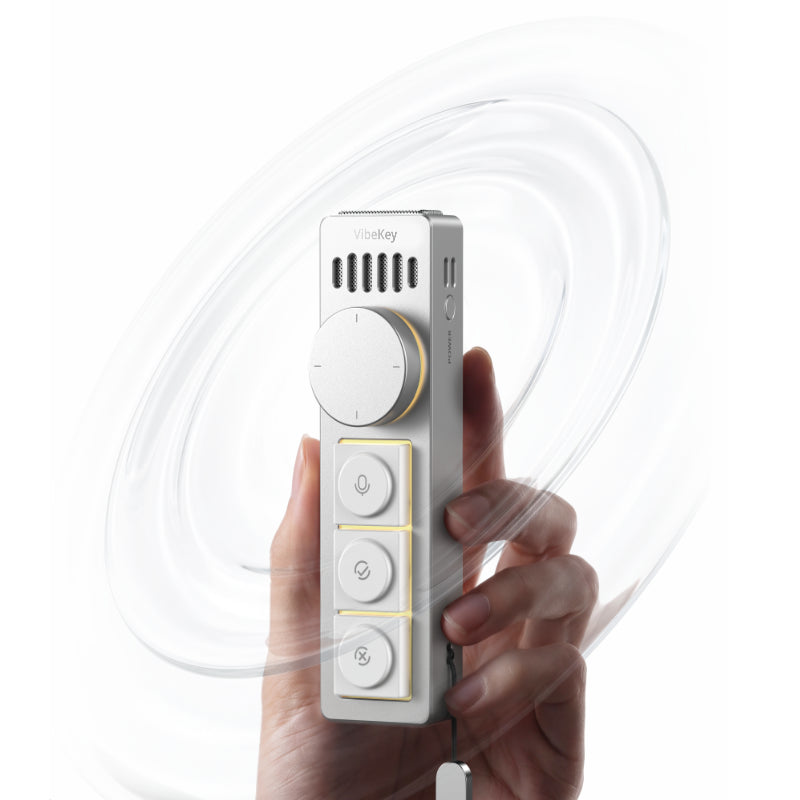

# Typist — Driver & Voice Assistant for Ulanzi Vibe Key AU05

<p align="center">
  <a href="https://www.ulanzi.com/products/ulanzi-au05-vibe-key-ai-voice-input-keypad-i018">
    
  </a>
</p>

<p align="center">
  <b>Open-source driver and cross-platform voice typing assistant for the <a href="https://www.ulanzi.com/products/ulanzi-au05-vibe-key-ai-voice-input-keypad-i018">Ulanzi Vibe Key AU05</a> (<code>fff1:00dd</code>).</b>
</p>

Typist captures the AU05 voice key, records speech from the built-in microphone, transcribes it using **Whisper** (either locally in-process with `faster-whisper` or via any remote OpenAI-compatible STT endpoint), and emulates native keystrokes directly into any active window on Linux (Wayland / GNOME / X11), Windows, and macOS.

---

## 🚀 Features

- **USB Keepalive / Anti-Disconnect**: Keeps device descriptors open to prevent the AU05 firmware's 4-second idle USB disconnect/reconnect loop.
- **Hardware-Level Key Capture**: Decodes raw HID reports (`Report ID 0x03`) to read the Voice Key (scancode `0x01`, which standard OS keyboard drivers ignore).
- **Flexible Whisper STT**:
  - **Local Mode**: Uses `faster-whisper` for fast, offline, on-device transcription with automatic GPU/CPU detection.
  - **Remote Mode**: Connects to any OpenAI-compatible Whisper endpoint (Speaches, vLLM, OpenAI, Groq, local homelab server).
- **Native OS Keyboard Emulation**: Types text directly at your cursor into any focused application (browsers, text editors, terminals, Slack, Discord, etc.).
- **Dictation Modes**: Push-to-Talk (hold key to speak, release to type) or Toggle mode.

---

## 📦 Installation & Packaging

### Linux (Debian / Ubuntu)

#### Option A: Install via `.deb` package
Download the latest `typist_0.1.0_all.deb` from Releases, or build it locally:
```bash
./packaging/linux/build_deb.sh
sudo dpkg -i dist/typist_0.1.0_all.deb
```

Ensure your user is in the `plugdev` group for non-root hardware access:
```bash
sudo usermod -a -G plugdev $USER
```

Run in terminal:
```bash
typist
```

Or enable as a user service:
```bash
systemctl --user enable --now typist
```

#### Option B: Install from source
```bash
git clone https://github.com/kubja/ulanzi-vibekey.git
cd typist
python3 -m venv .venv
source .venv/bin/activate
pip install -e ".[linux,local-whisper]"

# Apply udev rules
sudo cp udev/*.rules /etc/udev/rules.d/
sudo udevadm control --reload-rules && sudo udevadm trigger
```

---

### Windows

1. Download and run `Typist-Setup-0.1.0.exe` from the latest GitHub Release.
2. The installer provides options to create a Desktop shortcut and launch automatically on Windows startup.
3. Plug in your AU05, and Typist will automatically connect to it.

To build the Windows executable/installer from source:
```bat
packaging\windows\build_windows.bat
```

---

### macOS

1. Download `typist-macos-0.1.0.tar.gz` from Releases and extract to `/usr/local/bin/`.
2. Grant **Accessibility / Input Monitoring** permissions to `typist` in *System Settings -> Privacy & Security*.
3. To start automatically on login via `launchd`:
```bash
cp packaging/macos/com.typist.au05.plist ~/Library/LaunchAgents/
launchctl load ~/Library/LaunchAgents/com.typist.au05.plist
```

---

## 💻 CLI Usage & Configuration

```bash
# Run with local faster-whisper on CPU or GPU
typist --mode local --local-model base

# Run pointing to a remote Whisper API
typist --mode remote --url http://localhost:8008/v1/audio/transcriptions --model openai/whisper-large-v3-turbo

# Generate a default configuration file
typist --init-config
```

### Configuration Reference (`typist.toml` / `.env`)

| Option | Environment Variable | Default | Description |
| :--- | :--- | :--- | :--- |
| `mode` | `WHISPER_MODE` | `remote` | `remote` (OpenAI-compatible API) or `local` (faster-whisper) |
| `api_url` | `WHISPER_API_URL` | `http://localhost:8008/v1/audio/transcriptions` | Remote Whisper endpoint URL |
| `api_key` | `WHISPER_API_KEY` | `""` | Optional bearer token for remote API |
| `model` | `WHISPER_MODEL` | `openai/whisper-large-v3-turbo` | Remote model identifier |
| `local_model_size` | `WHISPER_LOCAL_MODEL` | `base` | Model size for local STT (`tiny`, `base`, `small`, `medium`, `large-v3`) |
| `local_device` | `WHISPER_LOCAL_DEVICE` | `auto` | `auto`, `cpu`, or `cuda` |
| `dictation_mode` | `DICTATION_MODE` | `hold` | `hold` (push-to-talk) or `toggle` (tap to start/stop) |
| `append_space` | `APPEND_SPACE` | `true` | Appends a space after each dictated sentence |
| `key_delay` | `KEY_DELAY` | `0.003` | Delay between keystrokes in seconds |

---

## 📖 Technical Documentation

For in-depth details on the USB reverse engineering, descriptors, HID report tables, and keepalive discovery, see:
- [Hardware & Protocol Specification](docs/hardware_protocol.md)

---

## 📜 License

MIT License. See [LICENSE](LICENSE) for details.
